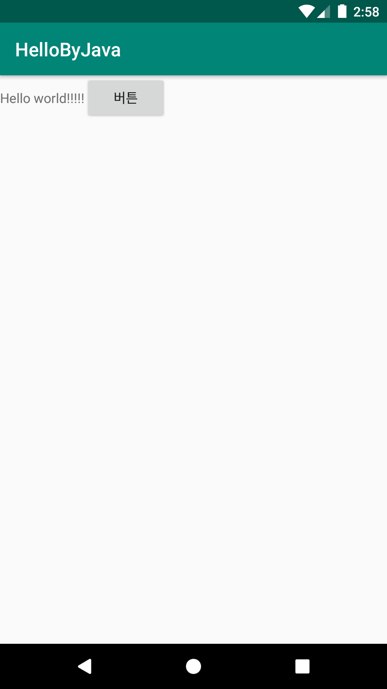

# HelloByJava
두번째 안드로이드 네이티브 앱 개발 수업 예제 : 자바언어만을 사용하여 화면제작

# 주요코드
java언어만으로 액티비티 화면 구현하기
액티비티가 화면에 꾸미는 기법을 알아보기 위한 예제

- 이 예제처럼 java언어만으로 화면을 꾸미면 다소 복잡함. Java언어의 AWT나 SWING을 익힌 분들은 좀 익숙할 수 있음.
- 그래서 xml언어에 화면에 보여질 View들을 배치하고 이를 .java문서에서 제어하는 방식이 더 효과적이어서 이 기법을 기본으로하여 앱을 구현함.

# 실행모습

  
  

  
